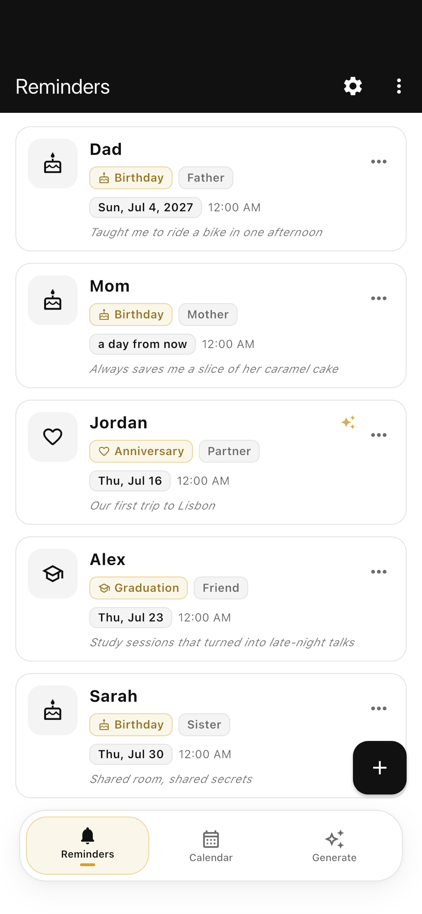
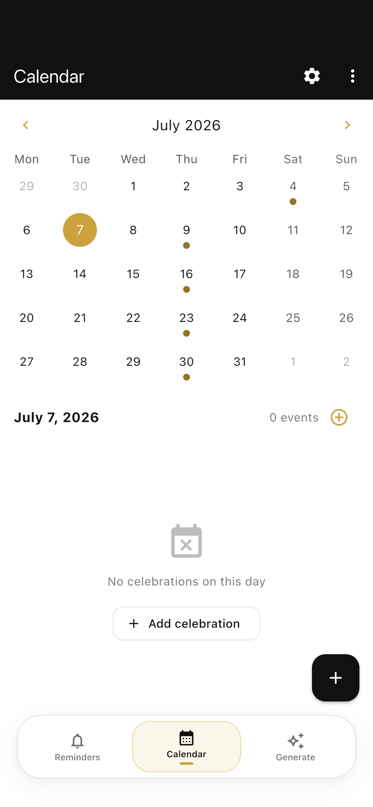
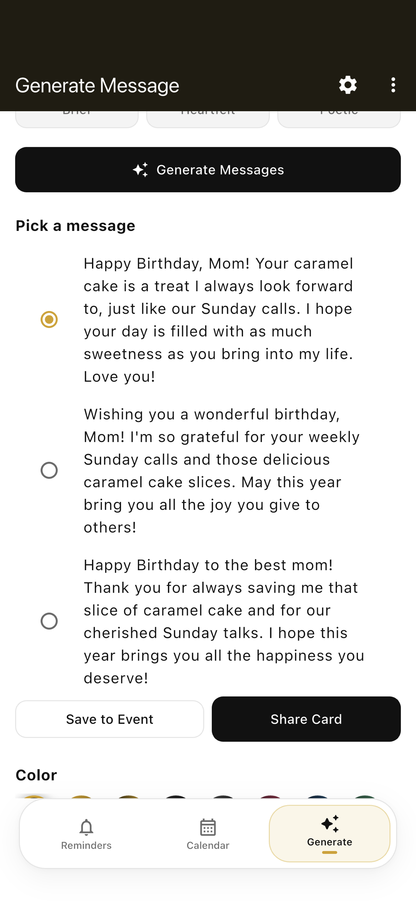
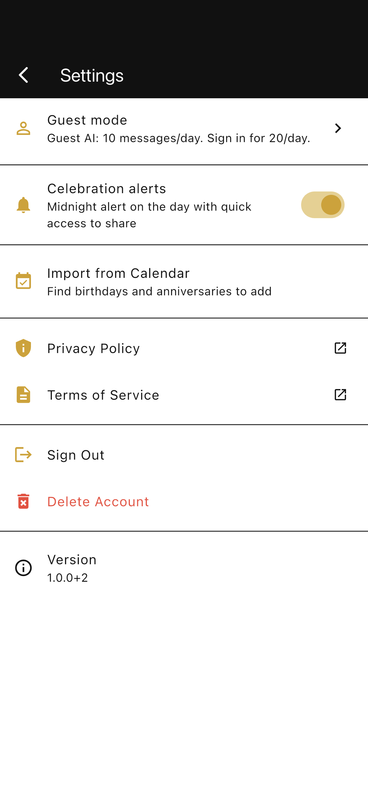
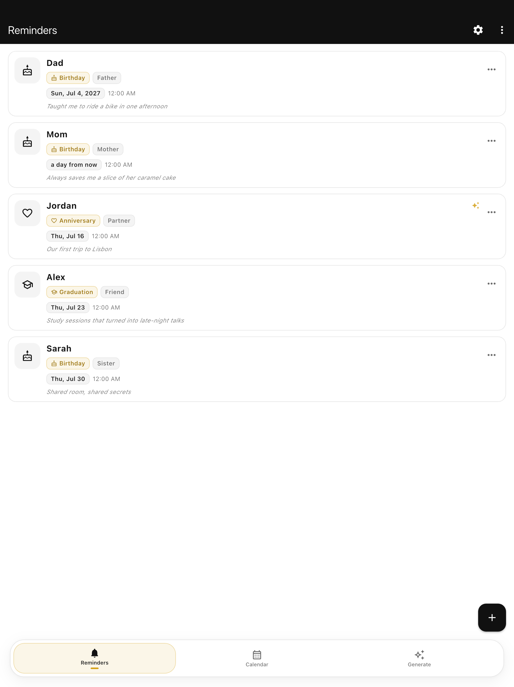
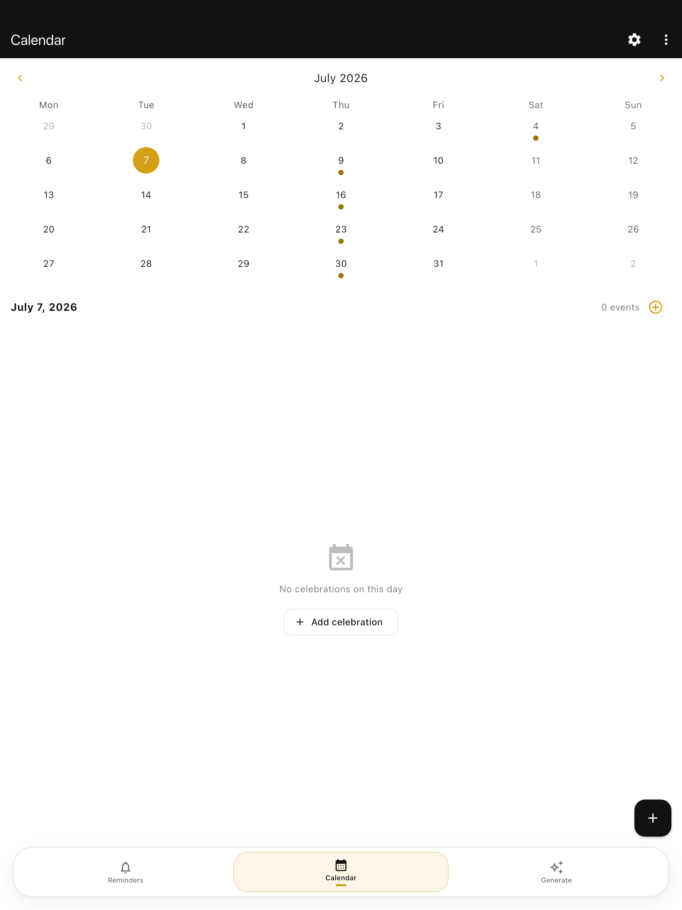
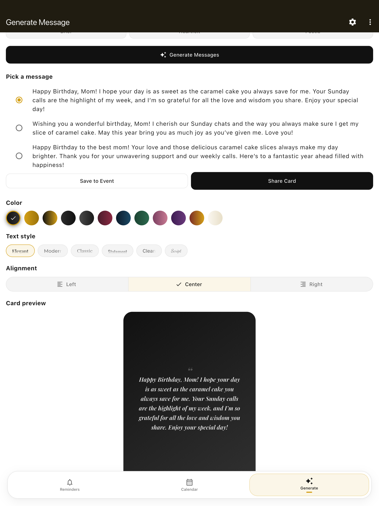

# Celebray

**Celebray** helps you remember and celebrate the people and moments that matter — birthdays, anniversaries, graduations, and more — with smart reminders, AI-powered messages, and shareable greeting cards.

**Website:** [celebray.web.app](https://celebray.web.app)

---

## What Celebray does

Celebray is a celebration reminder app that keeps important dates organized and helps you show up with a thoughtful message — not a last-minute scramble.

- **Track celebrations** — Add who it's for (e.g. David, or David & Jessica), pick the occasion (Birthday, Anniversary, Wedding, …), and store relationship context, memories, and photos.
- **Never forget** — Midnight notification on the celebration day with a quick path to messages and sharing.
- **Write with AI** — Generate personalized greetings in 9 tones (warm, funny, formal, prayerful, romantic, casual, brief, heartfelt, poetic). Touch up saved messages anytime.
- **Share beautifully** — Send text or export greeting cards as images.
- **Import from calendar** — Scan your device calendar for birthdays and anniversaries you have not added yet.
- **Privacy-first** — Events stay on your device. Sign-in is optional. See our [Privacy Policy](https://celebray.web.app/privacy).

Optional **Google / Apple sign-in** unlocks a higher daily AI limit. Guest mode works without an account.

---

## Screenshots

### iPhone

<p align="center">
  
  
  
  
</p>

<p align="center">
  <em>Reminders · Calendar · Generate · Settings</em>
</p>

### iPad (13-inch)

<p align="center">
  
  
  
</p>

<p align="center">
  <em>Reminders · Calendar · AI generator</em>
</p>

Store-ready assets also live under `store_screenshots/ios/` (`6.7-inch`, `13-inch-ipad`, `1242x2688`). Regenerate with:

```bash
./scripts/capture_ios_screenshots.sh
./scripts/capture_ipad_screenshots.sh
```

---

## Features

- Reminders list with rich event profiles (relationship, closeness, memories, photos)
- Calendar view of upcoming celebrations
- Celebration-day local notifications (smart copy; opens generator or touch-up)
- AI message generation and touch-up via Firebase Cloud Functions + OpenAI
- Shareable greeting cards (PNG) and plain-text sharing
- Calendar import (iOS / Android) with duplicate detection
- Optional Google / Apple sign-in; guest AI with anonymous Firebase auth
- Web favicon and PWA icons for [celebray.web.app](https://celebray.web.app)

## Tech stack

- **Flutter** (Material 3) · **Riverpod** · **sqflite** (local events)
- **Firebase** Auth, Crashlytics, Cloud Functions, Firestore (AI rate limits)
- **flutter_local_notifications** · **device_calendar** · **table_calendar**
- **share_plus** · **image_picker** · **google_sign_in** · **sign_in_with_apple**

## Getting started

```bash
git clone https://github.com/oluwasegunilori/celebray.git
cd celebray
flutter pub get
dart run flutter_launcher_icons
flutter run
```

### Requirements

- Flutter SDK ^3.8
- Xcode (iOS) and/or Android Studio
- Firebase project configured (`lib/firebase_options.dart`, `GoogleService-Info.plist`, `google-services.json`)

### Tests

```bash
flutter analyze
flutter test
```

---

## Contributing

Contributions are welcome — whether that's a bug report, feature idea, docs improvement, or pull request.

1. **Fork** the repo and create a branch from `main`.
2. **Make your changes** — keep PRs focused; match existing style.
3. **Run** `flutter analyze` and `flutter test`.
4. **Open a pull request** with a clear description and screenshots for UI changes.

Please do not commit secrets (`.env`, API keys, keystores). Use `ios/fastlane/.env.example` as a template.

For questions or support: [support@celebray.app](mailto:support@celebray.app)

---

## Store release checklist

1. Create Android upload keystore and `android/key.properties` (see `key.properties.example`)
2. Run `dart run flutter_launcher_icons`
3. Deploy legal pages: `firebase deploy --only hosting`
4. Capture screenshots: `./scripts/capture_ios_screenshots.sh` and `./scripts/capture_ipad_screenshots.sh`
5. Run `flutter analyze` and `flutter test` before submitting

### Store URLs

| Field | URL |
| --- | --- |
| Privacy Policy | https://celebray.web.app/privacy |
| Terms of Service | https://celebray.web.app/terms |
| Support URL | https://celebray.web.app/support |
| Marketing / Website | https://celebray.web.app |

## TestFlight (Fastlane)

Prerequisites: Apple Developer Program, Xcode signing for `com.shegz.celebray`, and an app record in App Store Connect.

```bash
cd ios
bundle install
cp fastlane/.env.example fastlane/.env
# Edit fastlane/.env with App Store Connect API key

set -a && source fastlane/.env && set +a
bundle exec fastlane beta
```

Bump `version: x.y.z+build` in `pubspec.yaml` before each upload.

## Legal

Source documents (also published at the URLs above):

- [Privacy Policy](docs/privacy_policy.md)
- [Terms of Service](docs/terms_of_service.md)

---

## License

Private / all rights reserved unless otherwise noted by the repository owner.
